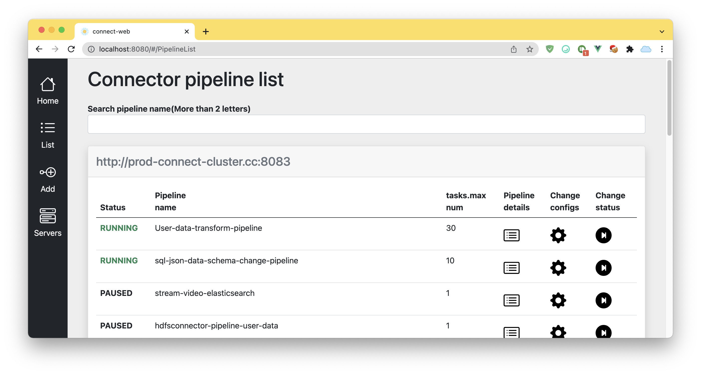

# kafka-connect-web



This project is a web tool for operating kafka connect. 
Kafka source/sink connectors can be created, modified, and deleted through the web. 
It can also operate connections linked to multiple Kafka connect clusters. 
You can use it for immediate operation through the docker image.

## Features

- Managing kafka connectors
- Multiple Kafka Connect Cluster support
- Create source/sink connectors
- Modify, delete source/sink connectors
- Look up connector plugins

## Quickstart with docker image

```
$ docker run -d -p 8080:8080 \
             -e "VUE_APP_CONNECT_SERVERS=http://connect:8083,http://connect2:8083" \
             officialkakao/kafka-connect-web:latest
```

### Build & Run from source

```
$ git clone https://github.com/kakao/kafka-connect-web.git
$ cd kafka-connect-web
$ export VUE_APP_CONNECT_SERVERS=http://connect:8083,http://connect2:8083
$ npm run build
$ npm run serve
```

## License

This software is licensed under the [Apache 2 license](LICENSE), quoted below.

Copyright 2022 Kakao Corp. <https://www.kakaocorp.com>

Licensed under the Apache License, Version 2.0 (the "License"); you may not
use this project except in compliance with the License. You may obtain a copy
of the License at http://www.apache.org/licenses/LICENSE-2.0.

Unless required by applicable law or agreed to in writing, software
distributed under the License is distributed on an "AS IS" BASIS, WITHOUT
WARRANTIES OR CONDITIONS OF ANY KIND, either express or implied. See the
License for the specific language governing permissions and limitations under
the License.
